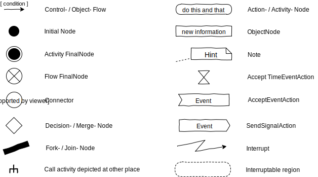

<button id="printMe" style="float: right" onclick="{
    let bodyHTML = document.body.innerHTML;
    let button = document.querySelector('button#printMe');
    button.parentNode.removeChild(button);
    let sectionHTML = document.querySelector('section').innerHTML;
    document.body.innerHTML = sectionHTML;
    print();
    document.body.innerHTML = bodyHTML;
  }" >Print</button> 

## Anhang

# 1. Unified Modelling Language

## 1.1. Use Case Diagram

<p style="page-break-after:always;"></p>  

## 1.2. Activity Diagram

### 1.2.1. Elements


### 1.2.2. Basic flow structure
<table>
<th align="left">Linear</th>
<tr></tr>
<tr><td></td></tr>
<tr><td><pre lang="typescript">
console.log("Hello");
</pre></td></tr>
</table>

<table>
<th align="left">Conditional</th>
<tr></tr>
<tr><td></td></tr>
<tr><td><pre lang="typescript">
...
if (!(x > 1))
  console.log("Hello");
</pre></td></tr>
</table>

<table>
<th align="left">Exclusive Conditional</th>
<tr></tr>
<tr><td></td></tr>
<tr><td><pre lang="typescript">
...
if (x > 1)
  console.log("Goodbye");
else
  console.log("Hello");
console.log(", my dear");
</pre></td></tr>
</table>

<table>
<th align="left">Multiple Conditions</th>
<tr></tr>
<tr><td></td></tr>
<tr><td><pre lang="typescript">
...
let patronus: string;
switch (person) {
  case "Harry":
    patronus = "Deer";
    break;
  case "Hermine":
    patronus = "Otter";
    break;
  case "Ron":
    patronus = "Rat";
    break;
  default:
    patronus = "not found";
    break;
}
console.log(patronus);
</pre></td></tr>
</table>

### 1.2.3. Loop

<table>
<th align="left">Pre Test</th>
<tr></tr>
<tr><td></td></tr>
<tr>
<table><tr><td valign="top">Option 1<pre lang="typescript">
let i: number = 0;
while (i < 10) {
  console.log(i);
  i++;
}
</pre></td><td valign="top">Option 2<pre lang="typescript">
for (let i: number = 0; i < 10; i++)
  console.log(i);
</pre></td></tr>
</table>
</tr>
</table>

<table>
<th align="left">Post Test</th>
<tr></tr>
<tr><td></td></tr>
<tr><td><pre lang="typescript">
let i: number = 0;
do {
  console.log(i);
  i++;
} while (i < 10);
</pre></td></tr>
</table>

<table>
<th align="left">Complex Control</th>
<tr></tr>
<tr><td></td></tr>
<tr><td><pre lang="typescript">
...
for (let i: number = b; i > 1; i/=2) {
  if (i == 3)
    continue;
  if (i == a)
    break;
  console.log(i);
}
</pre></td></tr>
</table>


<table>
<th align="left">All keys or indices</th>
<tr></tr>
<tr><td></td></tr>
<tr><td><pre lang="typescript">
let o = {x:1, y:2};
for (let key in o) {
  console.log(o[key]);
}
</pre></td></tr>
</table>


<table>
<th align="left">All values</th>
<tr></tr>
<tr><td></td></tr>
<tr><td><pre lang="typescript">
let o = {x:1, y:2};
for (let value of o) {
  console.log(o);
}
</pre></td></tr>
</table>

### 1.2.4 Subactivity

<table>
<th align="left">Subactivity simple</th>
<tr></tr>
<tr><td></td></tr>
<tr>
<table><tr><td valign="top">Function<pre lang="typescript">
greet();
function greet(): void {
  console.log("Hello");
}
</pre></td><td valign="top">Method<pre lang="typescript">
Greeter.greet();
class Greeter {
  public static greet(): void {
      console.log("Hello");
  }
}
</pre></td></tr>
</table>
</tr>
</table>

<table>
<th align="left">Subactivity with input and output</th>
<tr></tr>
<tr><td></td></tr>
<tr><td valign="top">Function<pre lang="typescript">
let name: string = "my friend";
let text: string = createGreeting(name);
console.log(text);
<br/>
function createGreeting(_to: string): string {
  let greeting: string;
  greeting = "Hello, " + _to;
  return greeting;
}
</pre></td></tr>
<tr><td valign="top">Method<pre lang="typescript">
let name: string = "my friend";
let text: string = Greeter.createGreeting(name);
console.log(text);
<br/>
class Greeter {
  public static createGreeting(_to: string): string {
    let greeting: string;
    greeting = "Hello, " + _to;
    return greeting;
  }
}
</pre></td></tr>
</table>

### 1.2.5 Signals

<table>
<th align="left">Accept Event</th>
<tr></tr>
<tr><td></td></tr>
<tr><td><pre lang="typescript">
someEventTarget.addEventListener("triggerGreet", greet);
</pre></td></tr>
</table>

<table>
<th align="left">Send Signal</th>
<tr></tr>
<tr><td></td></tr>
<tr><td><pre lang="typescript">
let event: Event = new Event("triggerGreet");
someEventTarget.dispatchEvent(event);
</pre></td></tr>
</table>

<table>
<th align="left">Accept Time Event</th>
<tr></tr>
<tr><td></td></tr>
<tr><td><pre lang="typescript">
window.setTimeout(greet, 2000);
</pre></td></tr>
</table>

<p style="page-break-after:always;"></p>  

## 1.3. Class Diagram
### 1.3.1. Structure

  

### 1.3.2. Modifiers

|  Symbol/Format  | Meaning               |
|:---------------:|-----------------------|
|        +        | public                |
|        #        | protected             |
|        -        | private               |
|   underlined    | static                |
|     italic      | abstract              |
| << interface >> | specifies interface   |
|   << enum >>    | specifies enumeration |

<p style="page-break-after:always;"></p>  

### 1.3.3. Example

<table>
<th align="center">Class Diagram</th>
<th align="center">Typescript Code</th>
<tr></tr>
<tr><td valign="top"><br/></td>
<td valign="top"><pre lang="typescript" style="font-size:x-small">
interface Course {
  name: string;
  docent?: Docent;
  students: Student[];
}
<br/>
class Person {
  public name: string;
  protected age: number;
  public constructor(_name: string, _age: number) {
    this.name = _name;
    this.age = _age;
  }
  public getInfo(): string {
    return this.name;
  }
}
<br/>
class Docent extends Person {
  private skills: string[] = [];
  public getInfo(): string {
    return "Prof. " + super.getInfo() + ", age: " + this.age;
  }
  public addSkill(_skill: string): void {
    this.skills.push(_skill);
  }
}
<br/>
class Student extends Person {
  private static nextNumber: number = 0;
  private matriculation: number;
  public constructor(_name: string, _age: number) {
    super(_name, _age);
    this.matriculation = Student.nextNumber;
    Student.nextNumber++;
  }
  public getInfo(): string {
    return  this.matriculation + ": " + super.getInfo();
}
</pre></td></tr>
</table>

### 1.3.4. Example Main Program

```typescript
let courses: Course[] = [];
let course: Course = { name: "Physics", students: [] };
course.docent = new Docent("Einstein", 71);
course.docent.addSkill("Relativity");

let student: Student = new Student("Heisenberg", 49);
course.students.push(new Student("Hawking", 8), student);
courses.push(course);
courses.push({
  name: "Art",
  students: [student, new Student("Dali", 46)]
});

for (let course of courses) {
  console.log("Course: " + course.name);
  
  if (course.docent)
    console.log("~ Docent: " + course.docent.getInfo());
  else
    console.warn("~ No docent assigned to this course");

  for (let student of course.students)
    console.log("~ Student " + student.getInfo());
}
```

**Output**\
Course: Physics\
~ Docent: Prof. Einstein, age: 71\
~ Student 1: Hawking\
~ Student 0: Heisenberg\
Course: Art\
~ No docent assigned to this course\
~ Student 0: Heisenberg\
~ Student 2: Dali

# 2. Design


