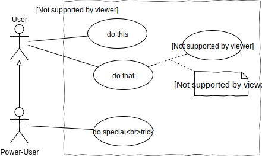
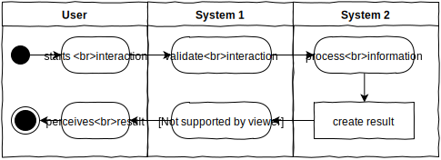

<button id="printMe" style="float: right" onclick="{
    let bodyHTML = document.body.innerHTML;
    let button = document.querySelector('button#printMe');
    button.parentNode.removeChild(button);
    let sectionHTML = document.querySelector('section').innerHTML;
    document.body.innerHTML = sectionHTML;
    print();
    document.body.innerHTML = bodyHTML;
  }" >Print</button> 

**Anhang**

# 1. Unified Modelling Language
Digital Media Designers need a precise and international language to create ideas and convey their designs to a team of developers. 
The Unified Modelling Language (UML) fulfills this requirement not only in the realm of software development,
but for arbitrary complex systems. Its development started in the 1990s and is still going on. 
It is standardized as ISO/IEC 19505. UML makes systems, algorithms and data structures visible and tangible, 
thus enabling the designers and their teams to discuss, improve and produce them not only in early stages of development,
but throughout the process, and, done well, even produces in large parts the final documentation.

This little booklet displays only three of the many types of diagrams UML 2.5 defines:
- Use Case Diagram
- Activity Diagram
- Class Diagram

and of those only a subset of the features. 
This resembles the minimum expertise a Digial Media Designer needs to master and should be sufficient to design systems of non trivial complexity. 

## 1.1. **Use Case Diagram**
A use case diagram modells a system on a very high level of abstraction from the perspective of the user. 
The system is modelled as a black box, offering interactions to the user. 
There may be various user roles using different interactions the system offers. 



User roles may be extended to access more interactions, e.g. Power-User extends User.
Use cases may include internal use cases that can also be depicted in the diagram.

<p style="page-break-after:always;"></p>  

## 1.2. **Activity Diagram**
This type of diagram is arguably the most versatile of the UML diagrams.
An activity diagram models the behaviour of a system.
While natural language is only suited to describe simple processes,
using the graphical language in two dimensions and nesting (sub-activities) enables the designer to describe basically arbitrary complexity
while maintaining readability and comprehensibility.
In this chapter, designs displayed are on a very low level, so that they can be translated into very low level code for explanation.
But the same structures apply when working with activities that nest atomic actions. 
By nesting activities in again larger activities and so forth, the designer works on different levels of abstractions.

However, in the design process, the designer starts with the activities definied in the use case diagram,
splits them up in smaller ones, and those again in even smaller, until all activities designed are trivial 
and the initial problem is solved.

### 1.2.1. Elements


### 1.2.2. Basic flow structure
<table>
<th align="left">Linear</th>
<tr></tr>
<tr><td></td></tr>
<tr><td><pre lang="typescript">
console.log("Hello");
</pre></td></tr>
</table>

<table>
<th align="left">Conditional</th>
<tr></tr>
<tr><td></td></tr>
<tr><td><pre lang="typescript">
...
if (!(x > 1))
  console.log("Hello");
</pre></td></tr>
</table>

<table>
<th align="left">Exclusive Conditional</th>
<tr></tr>
<tr><td></td></tr>
<tr><td><pre lang="typescript">
...
if (x > 1)
  console.log("Goodbye");
else
  console.log("Hello");
console.log(", my dear");
</pre></td></tr>
</table>

<table>
<th align="left">Multiple Conditions</th>
<tr></tr>
<tr><td></td></tr>
<tr><td><pre lang="typescript">
...
let patronus: string;
switch (person) {
  case "Harry":
    patronus = "Deer";
    break;
  case "Hermine":
    patronus = "Otter";
    break;
  case "Ron":
    patronus = "Rat";
    break;
  default:
    patronus = "not found";
    break;
}
console.log(patronus);
</pre></td></tr>
</table>

### 1.2.3. Loop

<table>
<th align="left">Pre Test</th>
<tr></tr>
<tr><td></td></tr>
<tr>
<table><tr><td valign="top">Option 1<pre lang="typescript">
let i: number = 0;
while (i < 10) {
  console.log(i);
  i++;
}
</pre></td><td valign="top">Option 2<pre lang="typescript">
for (let i: number = 0; i < 10; i++)
  console.log(i);
</pre></td></tr>
</table>
</tr>
</table>

<table>
<th align="left">Post Test</th>
<tr></tr>
<tr><td></td></tr>
<tr><td><pre lang="typescript">
let i: number = 0;
do {
  console.log(i);
  i++;
} while (i < 10);
</pre></td></tr>
</table>

<table>
<th align="left">Complex Control</th>
<tr></tr>
<tr><td></td></tr>
<tr><td><pre lang="typescript">
...
for (let i: number = b; i > 1; i/=2) {
  if (i == 3)
    continue;
  if (i == a)
    break;
  console.log(i);
}
</pre></td></tr>
</table>


<table>
<th align="left">All keys or indices</th>
<tr></tr>
<tr><td></td></tr>
<tr><td><pre lang="typescript">
let o = {x:1, y:2};
for (let key in o) {
  console.log(o[key]);
}
</pre></td></tr>
</table>


<table>
<th align="left">All values</th>
<tr></tr>
<tr><td></td></tr>
<tr><td><pre lang="typescript">
let o = {x:1, y:2};
for (let value of o) {
  console.log(o);
}
</pre></td></tr>
</table>

### 1.2.4. Subactivity

<table>
<th align="left">Subactivity simple</th>
<tr></tr>
<tr><td></td></tr>
<tr>
<table><tr><td valign="top">Function<pre lang="typescript">
greet();
function greet(): void {
  console.log("Hello");
}
</pre></td><td valign="top">Method<pre lang="typescript">
Greeter.greet();
class Greeter {
  public static greet(): void {
      console.log("Hello");
  }
}
</pre></td></tr>
</table>
</tr>
</table>

<table>
<th align="left">Subactivity with input and output</th>
<tr></tr>
<tr><td></td></tr>
<tr><td valign="top">Function<pre lang="typescript">
let name: string = "my friend";
let text: string = createGreeting(name);
console.log(text);
<br/>
function createGreeting(_to: string): string {
  let greeting: string;
  greeting = "Hello, " + _to;
  return greeting;
}
</pre></td></tr>
<tr><td valign="top">Method<pre lang="typescript">
let name: string = "my friend";
let text: string = Greeter.createGreeting(name);
console.log(text);
<br/>
class Greeter {
  public static createGreeting(_to: string): string {
    let greeting: string;
    greeting = "Hello, " + _to;
    return greeting;
  }
}
</pre></td></tr>
</table>

### 1.2.5. Signals

<table>
<th align="left">Accept Event</th>
<tr></tr>
<tr><td></td></tr>
<tr><td><pre lang="typescript">
someEventTarget.addEventListener("triggerGreet", greet);
</pre></td></tr>
</table>

<table>
<th align="left">Send Signal</th>
<tr></tr>
<tr><td></td></tr>
<tr><td><pre lang="typescript">
let event: Event = new Event("triggerGreet");
someEventTarget.dispatchEvent(event);
</pre></td></tr>
</table>

<table>
<th align="left">Accept Time Event</th>
<tr></tr>
<tr><td></td></tr>
<tr><td><pre lang="typescript">
window.setTimeout(greet, 2000);
</pre></td></tr>
</table>

<table>
<th align="left">Parallel Processing</th>
<tr></tr>
<tr><td></td></tr>
<tr><td><pre lang="typescript">
waitForSomething();
doSomethingElse();
<br/>
async function waitForSomething(): Promise&lt;void&gt; {
  console.log("starting to wait for something")
  await something();
  console.log("done waiting for something");
}
<br/>
function doSomethingElse(): void {
  console.log("doing something else")
}
</pre></td></tr>
</table>

**Output**  
```plaintext
starting to wait for something
doing something else
done waiting for something
```
### 1.2.6. Activity Partitions



## 1.3. Class Diagram
The class diagram models complex structures of information used in the system designed.
The focus is less on the activities within the system, but on the data those activities are applied to. 
Designing these structures well is crucial for the performance, stability, maintainability as well as the producibility of the system.
Thus, in complex systems, the class diagram and the activity diagrams are created in parallel, each reflecting on the other.

### 1.3.1. Structure

  

### 1.3.2. Modifiers

|  Symbol/Format  | Meaning               |
|:---------------:|-----------------------|
|        +        | public                |
|        #        | protected             |
|        -        | private               |
|   underlined    | static                |
|     italic      | abstract              |
| << interface >> | specifies interface   |
|   << enum >>    | specifies enumeration |

<p style="page-break-after:always;"></p>  

### 1.3.3. Example

<table>
<th align="center">Class Diagram</th>
<th align="center">Typescript Code</th>
<tr></tr>
<tr><td valign="top"><br/></td>
<td valign="top"><pre lang="typescript" style="font-size:x-small">
interface Course {
  name: string;
  docent?: Docent;
  students: Student[];
}
<br/>
class Person {
  public name: string;
  protected age: number;
  public constructor(_name: string, _age: number) {
    this.name = _name;
    this.age = _age;
  }
  public getInfo(): string {
    return this.name;
  }
}
<br/>
class Docent extends Person {
  private skills: string[] = [];
  public getInfo(): string {
    return "Prof. " + super.getInfo() + ", age: " + this.age;
  }
  public addSkill(_skill: string): void {
    this.skills.push(_skill);
  }
}
<br/>
class Student extends Person {
  private static nextNumber: number = 0;
  private matriculation: number;
  public constructor(_name: string, _age: number) {
    super(_name, _age);
    this.matriculation = Student.nextNumber;
    Student.nextNumber++;
  }
  public getInfo(): string {
    return  this.matriculation + ": " + super.getInfo();
}
</pre></td></tr>
</table>

### 1.3.4. Example Main Program

```typescript
let courses: Course[] = [];
let course: Course = { name: "Physics", students: [] };
course.docent = new Docent("Einstein", 71);
course.docent.addSkill("Relativity");

let student: Student = new Student("Heisenberg", 49);
course.students.push(new Student("Hawking", 8), student);
courses.push(course);
courses.push({
  name: "Art",
  students: [student, new Student("Dali", 46)]
});

for (let course of courses) {
  console.log("Course: " + course.name);
  
  if (course.docent)
    console.log("• Docent: " + course.docent.getInfo());
  else
    console.warn("• No docent assigned to this course");

  for (let student of course.students)
    console.log("• Student " + student.getInfo());
}
```

**Output**  
```plaintext
Course: Physics  
• Docent: Prof. Einstein, age: 71
• Student 1: Hawking
• Student 0: Heisenberg  
Course: Art
• No docent assigned to this course
• Student 0: Heisenberg
• Student 2: Dali
```

# 2. Design Process


# 3. Production
## 3.1. Coding Style
### 3.1.1. Naming
#### Self-explanatory
The developers code must be self-explanatory. This requires the strict use of naming conventions. Use names, that clearly explain the activity or information addressed and don't be greedy with letters. Short names are allowed only in very small scopes or when their meaning is clear by convention, such as `y` for a vertical position.
#### Variables and functions
The names of variables and functions must start lowercase and follow the camelCase notation, with uppercase letters indicating the start of a new part in a compound name such as `animalLion`. The names of variables describe an information or an object. Names of functions and methods strictly describe activities e.g. `calculateHorizontalPosition(...)` or questions e.g. `isHit()`
#### Formal parameters
Name formal parameters in a functions signature like variables, but prefix them with an underscore like `_event: Event`
#### Classes, interfaces and namespaces/modules
Names of classes, interfaces and namespaces or modules start with an uppercase Letter and then follow the camelCase notation (PascalCase). The name describes exactly one object of that type, not an activity. E.g. `ObjectManager`. 
#### Enums
The names of enumerations and their elements are written all uppercase, with underscores seperating parts of the name e.g. `EVENT_TYPES.EXIT_FRAME`
#### Avoid ambiguities
Bad example from the DOM-API: `getElementById(...)` vs `getElementsByTagName(...)`. Only the little `s` in the middle indicates that one returns a collection, not a single element. Better: `getElementCollectionByTagName(...)`. However, in `getElements(...)`, the `s` is clearly visible, since it's the last letter.
#### Prefixes
Some prefixes may be helpful for finding names for variables, use is encouraged  

| Prefix        | Example     | Meaning                  |
|---------------|-------------|--------------------------|
| `n`           | `nObjects`  | an amount                |
| `i`           | `iObject`   | an index                 |
| `x`, `y`, `z` | `xPos`      | a direction or dimension |
| `min`, `max`  | `maxHeight` | boundaries               |

#### Use context and reduce redundancy
For example, `state` may have different meaning depending on the context. `Machine.state` indicates something different than `Address.state`. However, it is redundant to write `Machine.stateTheMachineOperatesIn` or `Address.stateAsThePoliticalEntity`, since the context is provided already by the namespaces. Use this instead of implementing redundancies.

### 3.1.2. Comments
Use comments sparsely! If you feel that some code needs commenting rethink it and the naming of its components. Remember that you need to maintain comments just as you need to maintain code. Otherwise comments are not only useless but obstructive. Comments are allowed in the following cases
- when using a documentation generator such as TypeDoc
- to display an explanation in the development environment e.g. when hovering with the mouse
- to mark regions in the code (use "# region" and "# endregion")

### 3.1.3. Structure
#### Size
A function should not consist of more than 20 lines of code. If possible, split it up into smaller functions each of which has an explanatory name. This way, the calling function consists of multiple calls that are easy to read and interpret, and the concerns are distributed to smaller functions with the same qualities.
Also, watch out for the size of classes, beware of monsters! Keep the number of attributes low
#### Separation of Concerns
One function/method should care only about one concern and do this well
#### Indentation Depth
A function should not indent more than two levels. Use return statements not only at the end, but so called "early outs" and throw exceptions to keep indentation level low.
#### Top Down
Order functions and methods in such a way, that the call sits above the called function in code. Reading from top to bottom, the code displays the hierarchy of calls making it possible to understand the overall structure first before diving into the details.

### 3.1.4. Miscellaneous
#### Explicit types
Strictly use explicit typing wherever possible. The type `any` is prohibited. 
#### Semicolons
Always end statements with semicolon.
#### Literal strings
Literal strings should be enclosed in double quotiation marks e.g. `"Hello World!"`
#### Magic numbers
Are simply disallowed. Never use a literal value in a function call when its meaning is not extremely obvious (e.g. `Math.pow(x, 5)` to retrieve x to the power of 5). In all other cases, define a variable with a explanatory name and assign the literal value to it. This way, there is a value and a meaning to it, and its value can be changed in a single place.
#### Files
Use one file per class. Interfaces may be compiled with classes using them and exceptions are allowed for small classes only used within the scope of the file. Use PascalCase for filenames, exactly the same name as the classes.
#### Additional reading
https://github.com/basarat/typescript-book/blob/master/docs/styleguide/styleguide.md  
https://github.com/Platypi/style_typescript  
https://github.com/excelmicro/typescript


## 3.2. Operatoren
Eine Liste der wichtigsten Operatoren in TypeScript / Javascript

### 3.2.1. Zuweisungsoperator
<table>
<tr><td width="40px">Op</td><td width="120px">Beispiel</td><td>Beschreibung</td></tr>  
<tr><td><code>=</code></td><td style="white-space:nowrap;"><code>x = 7;</code></td><td>Der Variablen auf der linken Seite wird der Wert auf der rechten Seite zugewiesen</td></tr>  
</table>

### 3.2.2. Arithmetische Operatoren  
<table>
<tr><td width="40px">Op</td><td width="120px">Beispiel</td><td>Beschreibung</td></tr>  
<tr><td><code>+</code></td><td style="white-space:nowrap;"><code>x + 5;</code></td><td>Addition: Liefert das Ergebnis der Addition des linken und rechten Wertes ohne Speicherung.</td></tr>  
<tr><td><code>-</code></td><td style="white-space:nowrap;"><code>17 - x;</code></td><td>Subtraktion: Liefert das Ergebnis der Subtraktion des linken und rechten Wertes ohne Speicherung.</td></tr>
<tr><td><code>*</code></td><td style="white-space:nowrap;"><code>5 * x;</code></td><td>Multiplikation: Liefert das Ergebnis der Multiplikation des linken und rechten Wertes ohne Speicherung.</td></tr>
<tr><td><code>/</code></td><td style="white-space:nowrap;"><code>x / 2;</code></td><td>Division: Liefert das Ergebnis der Division des linken durch den rechten Wert ohne Speicherung.</td></tr>
<tr><td><code>%</code></td><td style="white-space:nowrap;"><code>x % 10;</code></td><td>Modulo: Liefert den Rest der ganzzahligen Division des linken durch den rechten Wert ohne Speicherung.</td></tr>
</table>  

### 3.2.3. Kombinierte Operatoren  
<table>
<tr><td width="40px">Op</td><td width="120px">Beispiel</td><td>Beschreibung</td></tr>  
<tr><td><code>+=</code></td><td style="white-space:nowrap;"><code>x += 19;</code></td><td>Additionszuweisung: Der Wert der Variablen wird um den rechtsstehenden Wert erhöht. Gleichbedeutend mit <code>x = x + 19;</code></td></tr>
<tr><td><code>-=</code></td><td style="white-space:nowrap;"><code>x -= 3;</code></td><td>Subtraktionszuweisung: Der Wert der Variablen wird um den rechtsstehenden Wert vermindert. Gleichbedeutend mit <code>x = x - 3;</code></td></tr>
<tr><td><code>*=</code></td><td style="white-space:nowrap;"><code>x *= 100;</code></td><td>Multiplikationszuweisung: Der Wert der Variablen wird um den rechtsstehenden Faktor erhöht. Gleichbedeutend mit <code>x = x *100;</code></td></tr>
<tr><td><code>/=</code></td><td style="white-space:nowrap;"><code>x /= 4;</code></td><td>Divisionszuweisung: Der Wert der Variablen wird um den rechtsstehenden  Divisor vermindert. Gleichbedeutend mit <code>x = x / 4;</code></td></tr>
<tr><td><code>++</code></td><td style="white-space:nowrap;"><code>x++;</code></td><td>Inkrement: Der Wert der Variablen wird um 1 erhöht. Gleichbedeutend mit <code>x += 1;</code></td></tr>
<tr><td><code>--</code></td><td style="white-space:nowrap;"><code>x--;</code></td><td>Dekrement: Der Wert der Variablen wird um 1 vermindert. Gleichbedeutend mit <code>x -= 1;</code></td></tr>
</table>

### 3.2.4. Vergleichsoperatoren  
<table>
<tr><td width="40px">Op</td><td width="120px">Beispiel</td><td>Beschreibung</td></tr>  
<tr><td><code>==</code></td><td style="white-space:nowrap;"><code>x == "AB"</code></td><td>Wertgleichheit: Liefert den Wert true, wenn die Werte auf der linken und rechten Seite gleich sind. Vorsicht bei floats!!</td></tr>
<tr><td><code>===</code></td><td style="white-space:nowrap;"><code>x === "42"</code></td><td>Wert- und Typgleichheit: Liefert den Wert true, wenn die Wertgleichheit zutrifft und beide Ausdrücke auch vom gleichen Typ sind.</td></tr>
<tr><td><code>!=</code></td><td style="white-space:nowrap;"><code>x != "AB"</code></td><td>Ungleichheit: Liefert den Wert true, wenn die Werte auf der linken und rechten Seite unterschiedlich sind.</td></tr>
<tr><td><code>></code></td><td style="white-space:nowrap;"><code>x > 2.32</code></td><td>Größer: Liefert den Wert true, wenn der linke Wert größer als der rechte ist.</td></tr>
<tr><td><code><</code></td><td style="white-space:nowrap;"><code>x < 2.32</code></td><td>Kleiner: Liefert den Wert true, wenn der linke Wert kleiner als der rechte ist.</td></tr>
<tr><td><code>>=</code></td><td style="white-space:nowrap;"><code>x >= 2.32</code></td><td>Größergleich: Liefert den Wert true, wenn der linke Wert größer als der rechte oder genau gleich ist.</td></tr>
<tr><td><code><=</code></td><td style="white-space:nowrap;"><code>x <= 2.32</code></td><td>Kleinergleich: Liefert den Wert true, wenn der linke Wert kleiner als der rechte oder genau gleich ist.</td></tr>
</table>

### 3.2.5. Logische Operatoren  
<table>
<tr><td width="40px">Op</td><td width="120px">Beispiel</td><td>Beschreibung</td></tr>  
<tr><td><code>&&</code></td><td style="white-space:nowrap;"><code>x>2 && x<9</code></td><td>Und: Liefert den Wert true, wenn der linke und der rechte Ausdruck beide den Wert true haben. Hier, wenn x zwischen 2 und 9 liegt.</td></tr>  
<tr><td><code>||</code></td><td style="white-space:nowrap;"><code>x<2 || x>9</code></td><td>Oder: Liefert true, wenn wenigstens einer der beiden Ausdrücke true ist. Hier, wenn x außerhalb des Bereichs 2 bis 9 liegt.</td></tr>  
<tr><td><code>!</code></td><td style="white-space:nowrap;"><code>!(x > 10)</code></td><td>Nicht: Negiert den Ausdruck, liefert also true, wenn der folgende Ausdruck false ist. Hier, wenn x <= 10.</td></tr> 
</table>

### 3.2.6. Bitweise Operatoren
Damit werden direkt Bitmuster manipuliert. Siehe [MDN](https://developer.mozilla.org/en-US/docs/Web/JavaScript/Reference/Operators/Bitwise_Operators)

# 4. DOM-Klassenhierarchie
<table height="600px"><tr><td>

</td></tr></table>

# x. Ressources

- Object Management Group. (2015, Mai). About the Unified Modeling Language Specification Version 2.5. Abgerufen 18. Januar 2020, von https://www.omg.org/spec/UML/2.5
- Kecher, C., Salvanos, A., & Hoffmann-Elbern, R. (2017). UML 2.5: Das umfassende Handbuch. Ausgabe 2018. Inkl. DIN A2-Poster mit allen Diagrammtypen. Bonn: Rheinwerk Verlag GmbH.
- Oestereich, B., & Scheithauer, A. (2013). Analyse Und Design Mit Der Uml 2.5: Objektorientierte Softwareentwicklung (German Edition) (11th 11., Umfassend Uberarbeitete Und Aktualisierte Auflage ed.). München: Walter de Gruyter.
- Microsoft. (2020). TypeScript - JavaScript that scales. Abgerufen 18. Januar 2020, von http://www.typescriptlang.org/
